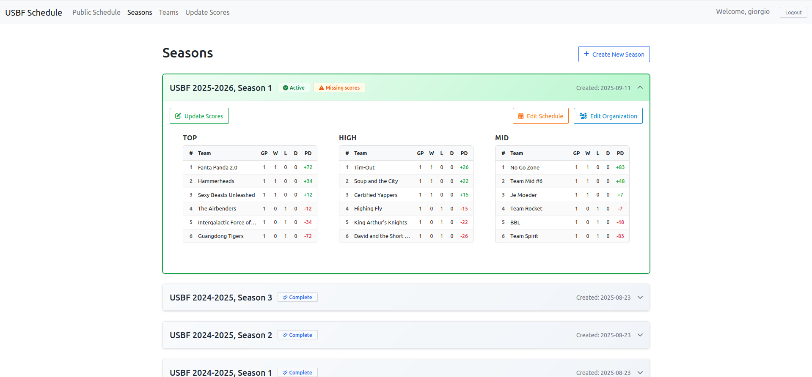
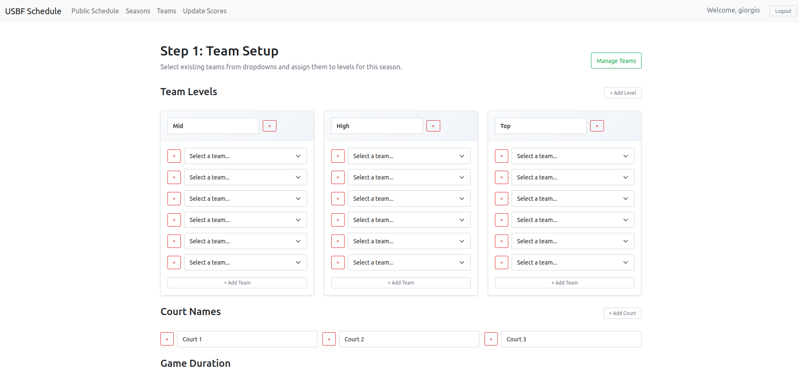
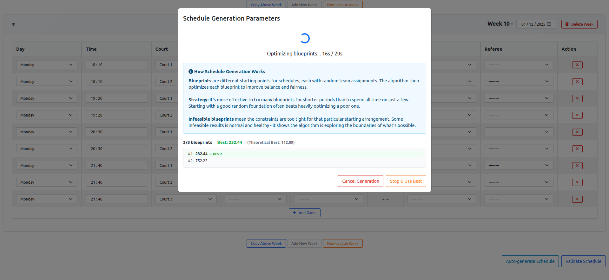
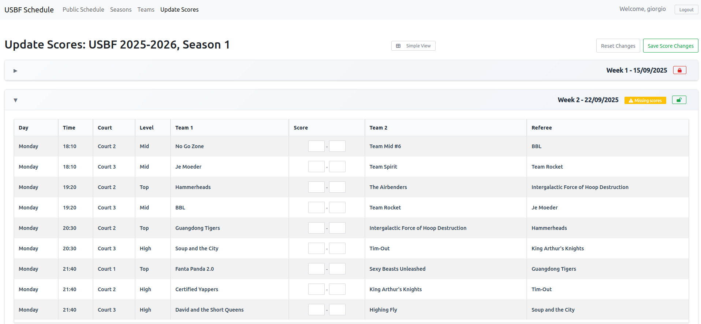
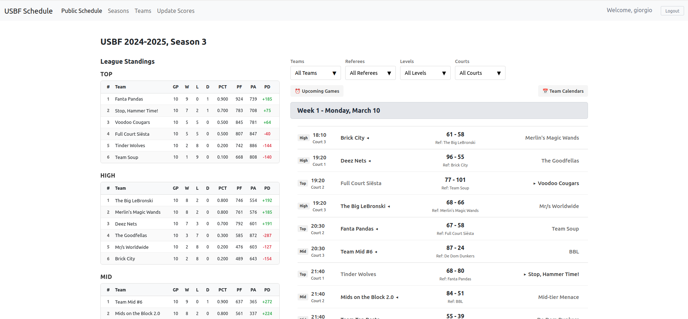

# USBF League Schedule Generator

A web application for creating balanced basketball league schedules across multiple divisions. Automatically generates fair schedules, assigns referees, and tracks scores throughout the season.

## What It Does

- **Creates Fair Schedules**: Every team plays every other team in their division equally
- **Balances Game Times**: Ensures no team gets stuck with all the early or late games  
- **Assigns Referees**: Automatically assigns referees from teams not playing, only in adjacent time slots
- **Tracks Scores**: Record and view game results throughout the season
- **Exports Calendars**: Download team schedules as calendar files

## Quick Start

1. **Clone and Install**
   ```bash
   git clone https://github.com/platelminto/usbf-schedule.git
   cd usbf-schedule
   uv sync && npm install
   ```

2. **Set Up Database**
   ```bash
   uv run python manage.py migrate
   uv run python manage.py createsuperuser
   ```

3. **Build and Run**
   ```bash
   npm run build
   uv run python manage.py runserver
   ```

4. **Access the App**
   - Go to `http://localhost:8001/scheduler/app/`
   - Log in with your superuser account
   - Create a season and start scheduling!

5. **Deploy Embedded Public Schedule**
   - Host on same domain as your site (or otherwise, allow various CORS/Allowed Origins/etc. stuff, and possibly hardcode some stuff e.g. in the calendar exports for the other domain)
   - Embed with:
```
<div id="schedule-embed"></div>
  <script src="https://example.com/scheduler/embed.js"></script>
```

## Development

- **Start Development Server**: `uv run python manage.py runserver`
- **Watch Frontend Changes**: `npm run dev` (in separate terminal)
- **Run Tests**: `uv run python manage.py test`

## Production Deployment

```bash
# 1. Setup environment
cp .env.example .env  # Edit with your values

# 2. Deploy with Docker
docker network create shared-network
docker-compose up -d
docker-compose exec web uv run python manage.py createsuperuser

# 3. Caddy reverse proxy (optional)
# Caddyfile: your-domain.com { reverse_proxy web:8001 }
```

**Required .env variables:**
- `SECRET_KEY`, `POSTGRES_PASSWORD`, `ALLOWED_HOSTS`, `CSRF_TRUSTED_ORIGINS`

## Features

### Schedule Generation
- **Smart Algorithm**: Uses linear programming optimisation to create optimal schedules
- **Multi-Division Support**: Handle multiple divisions with different team counts
- **Referee Management**: Teams referee games when they're not playing, and only in adjacent slots to when they played
- **Flexible Court Setup**: Configure different court availability per time slot

### Web Interface  
- **Season Management**: Create and manage multiple seasons
- **Team Organization**: Add, edit, and archive teams
- **Score Tracking**: Record game results and view standings
- **Calendar Export**: Download schedules for team calendars

### Validation & Balance
- **Comprehensive Testing**: Built-in validation ensures schedule quality
- **Balance Metrics**: View statistics on game time distribution
- **Conflict Detection**: Prevents teams from playing and refereeing simultaneously

## Requirements

- Python 3.10+
- Node.js 16+

## Screenshots

### Season Management

*Season overview showing multiple seasons with team counts and status*

### Schedule Setup

*Configuration interface for team assignment and court setup*

### Auto-Generation Process

*Real-time schedule generation with progress tracking and optimization metrics*

### Score Tracking

*Game score entry interface with team standings integration*

### Public Schedule View

*Clean, public-facing schedule display for teams and spectators*
